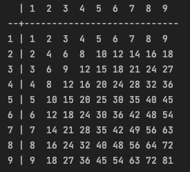
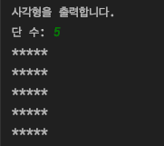

# 1장. 기본 알고리즘
## 1.1. 알고리즘이란?
- 순차적 구조(concatenation): 여러 문장(프로세스)이 순차적으로 실행되는 구조
- 선택 구조(selection): () 안에 있는 식의 결과값에 따라 프로그램의 실행 흐름을 변경하는 if문
### 매개변수
- 메서드에 전달되는 값을 저장하기 위해 선언하는 변수(=가인수)
- 실인수: 메서드를 호출할 때 사용하는 매개변수의 값

### 결정 트리
- 조합을 나열한 모양이 나무 형태인 것
- 왼쪽 끝(a>=b)에서 시작하여 오른쪽으로 이동함

### 세 값의 중앙값 구하기
- Arrays.sort()를 쓰면 쉽지만 직접 구현해보자
```java
package chap01;
// 세 값의 중앙값 구하기
public class Median {
    public int med3(int a, int b, int c) {
        if (a >= b) {
            if (b >= c)
                return b;
            else if (a <= c)
                return a;
            else
                return c;
        }
        else if (a > c)
            return a;
        else
            return b;
    }
}
```
- 아래와 같이 작성하면 효율이 떨어지는 이유?
```java
public int med3(int a, int b, int c) {
    if ((b >= a && c <= a) || (b <= a && c >= a))
        return a;
    else if ((a > b && c < b || (a < b && c > b))
        return b;
    return c;
}
```
## 1.2. 반복
### while문 반복
- 실행 전에 반복을 계속할지를 판단 -> `사전 판단 반복 구조`

### for문 반복
- 하나의 변수를 사용하는 반복문은 while문보다 for문을 사용하는 것이 좋음

### do ~ while문 - 양수만 입력하기
```java
package chap01;

import java.util.Scanner;

public class SumForPos {
    public static void main(String[] args) {
        final Scanner scanner = new Scanner(System.in);
        int n;

        System.out.println("1부터 n까지의 합을 구합니다.");

        do {
            System.out.print("n의 값: ");
            n = scanner.nextInt();
        } while (n <= 0); // n이 0보다 클 때까지 반복

        int sum = 0;

        for (int i = 1; i <= n; i++) {
            sum += i;
        }

        System.out.println("1부터 " + n + "까지의 합은 " + sum + "입니다.");
    }
}
```
- [연습문제1](doit/src/../../../doit/src/chap01/DiffOfTwoIntegers.java)
  - 두 변수 a, b에 정수를 입력하고 b - a를 출력하는 프로그램 작성하기
  - 변수 b에 입력한 값이 a 이하이면 b의 값을 다시 입력
- [연습문제2](../doit/src/chap01/DigitOfPos.java)
  - 양의 정수를 입력하고 그 수의 자릿수를 출력하는 프로그램 작성

### 구조적 프로그래밍
- 하나의 입구와 하나의 출구를 가진 구성 요소만을 계층적으로 배치하여 프로그램을 구성하는 방법
- 순차, 선택, 반복이라는 3가지의 제어 흐름을 사용함

### 다중 루프
- 연습문제1: 다음과 같이 위쪽과 왼쪽에 곱하는 수가 있는 곱셈표를 출력하는 프로그램 작성
<br/>
```java
package chap01;

public class MultiplicationTable {
    public static void main(String[] args) {
        for (int i = 0; i < 10; i++) {
            if (i == 0) {
                System.out.print("  | ");
                continue;
            }
            System.out.print(i + "  ");
        }
        System.out.println("\n--+----------------------------");
        for (int i = 1; i < 10; i++) {
            System.out.print(i + " | ");
            for (int j = 1; j < 10; j++) {
                System.out.print(i * j + " ");
                if (i * j < 10) {
                    System.out.print(" ");
                }
            }
            System.out.println();
        }
    }
}
```
- 연습문제2: 다음과 같이 입력한 수를 한 변으로 하는 정사각형을 * 기호로 출력하는 프로그램 작성
<br/>
```java
package chap01;

import java.util.Scanner;

public class Square {
    public static void main(String[] args) {
        final Scanner scanner = new Scanner(System.in);

        System.out.println("사각형을 출력합니다. ");
        System.out.print("단 수: ");
        int n = scanner.nextInt();

        for (int i = 1; i <= n; i++) {
            for (int j = 1; j <= n; j++) {
                System.out.print("*");
            }
            System.out.println();
        }
    }
}
```