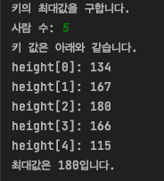

# 2장. 기본 자료구조
## 2.1. 배열
### 자료구조란?
- 데이터 단위와 데이터 자체 사이의 물리적 또는 논리적인 관계
### 배열이란?
- 같은 자료형의 변수로 이루어진 구성 요소가 모인 것
- 배열의 선언과 참조
```java
int[] a; // 선언하기
a = new int[5] // 참조하기
int[] a = new int[5] // 선언과 참조를 동시에
```
- int형의 배열 본체를 생성하고 그것을 변수 a가 '참조'하도록 설정한다
- 배열의 구성 요소는 자동으로 0으로 초기화됨

- 배열의 요소값을 초기화하며 배열 선언하기
```java
int[] a = {1, 2, 3, 4, 5};
```
- 배열의 복제
```java
// 기본적인 사용 방법
배열 이름.clone();
// 예제
package chap02;

public class CloneArray {
    public static void main(String[] args) {
        int[] a = {1, 2, 3, 4, 5};
        int[] b = a.clone();

        b[3] = 0; // 한 요소에만 0을 대입

        System.out.print("a =");
        for (int i = 0; i < a.length; i++)
            System.out.print(" " + a[i]);
        // a = 1 2 3 4 5
        System.out.print("\nb =");
        for (int i = 0; i < b.length; i++)
            System.out.print(" " + b[i]);
        // b = 1 2 3 0 5
    }
}
```
- 주사(traverse)
  - 배열의 요소를 하나씩 차례로 살펴보는 과정(알고리즘 용어)

### 토막 상식 - 지역 변수와 전역 변수
1. 지역 변수: stack 영역
- 지역(메소드) 안에서 선언된 변수
- 그 영역을 닫는 중괄호를 만났을 때 메모리에서 해제됨.
- 사용자가 직접 초기화해야 함
- 다른 영역에서 접근할 수 없음
2. 전역 변수: data 영역
- 클래스 영역 안에 있고, 전체 영역에서 사용 가능한 변수
- 클래스 영역 외의 어떠한 영역에도 포함되어있지 않다.
- `new`를 만났을 때 초기화됨.
- 프로그램 종료 시 메모리에서 해제됨
- 다른 영역에서도 접근할 수 있음(접근 제한자에 따라 달라짐)
3. static 변수: data 영역
- 컴파일을 하게 되면 가장 먼저 메모리에 올라가고, 어떠한 경우에도 초기화되지 않음
- 프로그램 종료 시 메모리에서 해제됨
- 메모리에 고정되기 때문에 남용 시 메모리 혹은 프로그램 실행 속도에 악영향을 줄 수 있음

#### 난수 사용해 배열의 요소값 설정하기
- `java.util.Random` 클래스 사용
```java
package chap02;

import java.util.Random;
import java.util.Scanner;

public class MaxOfArrayRandom {
    public static int maxOf(int[] arr) {
        int max = arr[0];

        for (int i = 1; i < arr.length; i++) {
            if (arr[i] > max)
                max = arr[i];
        }
        return max;
    }

    public static void main(String[] args) {
        Random random = new Random();
        Scanner scanner = new Scanner(System.in);

        System.out.println("키의 최대값을 구합니다.");
        System.out.print("사람 수: ");
        int num = scanner.nextInt();

        int[] height = new int[num];

        System.out.println("키 값은 아래와 같습니다.");
        for(int i = 0; i < num; i++) {
            height[i] = 100 + random.nextInt(90);
            System.out.println("height[" + i + "]: " + height[i]);
        }

        System.out.println("최대값은 " + maxOf(height) + "입니다. ");

    }
}
```
- random.nextInt(n): 0부터 n - 1까지의 난수 반환
- 실행 결과<br/>
<br/>
- [연습문제1](doit/src/chap02/../../../../doit/src/chap02/Question1.java): 키뿐만 아니라 사람 수도 난수로 생성하도록 실습 2-5를 수정하여 프로그램 작성하기

### 💡 배열 요소를 역순으로 정렬하기
```java
package chap02;

import java.util.Scanner;

public class ReverseArray { // 배열 요소 교환
    static void swap(int[] array, int idx1, int idx2) {
        int t = array[idx1];
        array[idx1] = array[idx2];
        array[idx2] = t;

    }

    static void reverse(int[] array) { // 배열 길이만큼 for문 돌며 swap 메서드 호출
        for (int i = 0; i < array.length / 2; i++) {
            swap(array, i, array.length - i - 1);
        }
    }

    public static void main(String[] args) {
        Scanner scanner = new Scanner(System.in);
        System.out.print("요소의 개수: ");
        int num = scanner.nextInt();

        int[] array = new int[num];

        for (int i = 0; i < num; i++) {
            System.out.print("array[" + i + "]: ");
            array[i] = scanner.nextInt();
        }

        reverse(array);

        System.out.println("역순 정렬 완료");
        for (int i = 0; i < num; i++) {
            System.out.println("array[" + i + "] = " + array[i]);
        }

    }
}

```